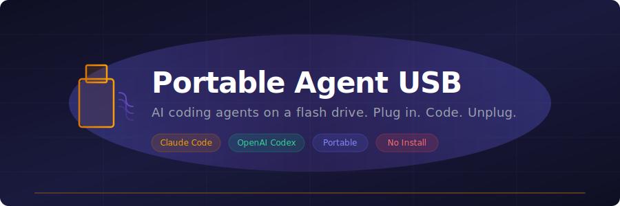

<p align="center">
  
</p>

<p align="center">
  <strong>Run Claude Code and OpenAI Codex from a USB drive. No installation needed.</strong>
</p>

<p align="center">
  <a href="https://github.com/bnovik0v/portable-agent-usb/blob/main/LICENSE"></a>
  
  
  
  
</p>

<p align="center">
  Plug in &rarr; Launch &rarr; Code &rarr; Unplug. No traces left on the host machine.
</p>

---

## Why?

You're at a friend's place. Their code is broken. You want to help — but installing Node.js, Claude Code, API keys... too much hassle on someone else's machine.

**Portable Agent USB** is a flash drive with everything pre-loaded. Plug it in, open a terminal, and your AI coding agent is ready. When you're done, unplug — nothing was installed.

## Features

- **Zero install** — portable Node.js runs directly from the USB
- **Claude Code + Codex CLI** — both agents, ready to use
- **Cross-platform** — works on Windows and Linux (x64)
- **OAuth support** — log in with your Claude Pro/Max or ChatGPT Plus subscription
- **Your config travels with you** — CLAUDE.md, skills, and settings on the drive
- **No traces** — all temp files, cache, and config stay on the USB

## Quick Start

### 1. Build the USB

Format a USB drive as **exFAT**, then:

```bash
git clone https://github.com/bnovik0v/portable-agent-usb.git
cd portable-agent-usb
bash setup.sh /mnt/your-usb-drive
```

The script downloads Node.js for both platforms, installs Claude Code and Codex, and sets up the launcher scripts. Takes a few minutes.

### 2. Authenticate

**Option A: OAuth (recommended)**

No API keys needed. Launch `claude` on first use — it opens a browser to log in. Your token is saved on the USB and works on any machine.

```bash
bash /mnt/your-usb-drive/start.sh
# type 'claude' — log in via browser
```

**Option B: API keys**

```bash
# Edit the key files on the USB
nano /mnt/your-usb-drive/config/env.sh       # Linux
notepad config\env.bat                         # Windows
```

```
ANTHROPIC_API_KEY=sk-ant-...
OPENAI_API_KEY=sk-...
```

> Both methods can coexist. If an API key is present, it takes priority over OAuth.

### 3. Use it

**Windows** — plug in, open the drive in File Explorer, double-click `start.bat`

**Linux** — plug in, open a terminal:

```bash
bash /media/$USER/AGENT-USB/start.sh
```

```
 ======================================
  Portable Agent USB
 ======================================
  Type 'claude' for Claude Code
  Type 'codex'  for OpenAI Codex
  Type 'exit'   to close
 ======================================
```

### 4. Customize (optional)

| What | Where |
|---|---|
| Global instructions | `config/.claude/CLAUDE.md` |
| Skills | `config/.claude/skills/` |
| Startup behavior | `start.sh` / `start.bat` |

## How It Works

```
USB Drive (exFAT)
├── bin/
│   ├── linux/node-v22.x/     ← Portable Node.js
│   └── win/node-v22.x/
├── tools/
│   ├── linux/{claude,codex}/  ← npm packages per platform
│   └── win/{claude,codex}/
├── config/
│   ├── .claude/               ← Your config, skills, auth token
│   └── env.sh / env.bat       ← API keys (optional)
├── temp/                      ← All temp/cache stays here
├── start.sh                   ← Linux launcher
└── start.bat                  ← Windows launcher
```

The launcher scripts set `PATH`, `CLAUDE_CONFIG_DIR`, `TMPDIR`, `APPDATA`, and other env vars to point everything at the USB. Nothing touches the host filesystem.

## No Traces

| What stays clean | How |
|---|---|
| No programs installed | Portable Node.js runs from USB |
| No files in user profile | APPDATA / HOME / TEMP redirected to USB |
| No npm cache on host | `NPM_CONFIG_CACHE` on USB |
| No config on host | `CLAUDE_CONFIG_DIR` on USB |
| Auth tokens portable | OAuth credentials saved on USB, not host |

> OS-level artifacts (USB device history in Windows registry, mount logs on Linux) are unavoidable and harmless.

## Requirements

| Requirement | Details |
|---|---|
| USB drive | 1 GB+ (USB 3.0 recommended) |
| Host PC | Windows 10/11 or Linux, x64 |
| Setup machine | Linux with `curl` and `unzip` |
| Auth | API keys **or** Claude Pro/Max / ChatGPT Plus subscription |

## Limitations

- **x64 only** — ARM devices not supported
- **No auto-run** — modern OSes block USB auto-execution for security; you click the launcher once
- **USB 2.0 is slow** — Node.js startup takes a few seconds; use USB 3.0
- **Windows cross-install** — if `claude` crashes on Windows, run `setup-windows.bat` on a Windows machine once to reinstall native binaries

## Contributing

Contributions welcome! Some ideas:

- macOS support
- ARM64 support
- Encrypted API key storage
- Auto-update mechanism for Claude Code / Codex versions

## License

[MIT](LICENSE)

---

<p align="center">
  <sub>Built for developers who help friends debug at 2 AM.</sub>
</p>
